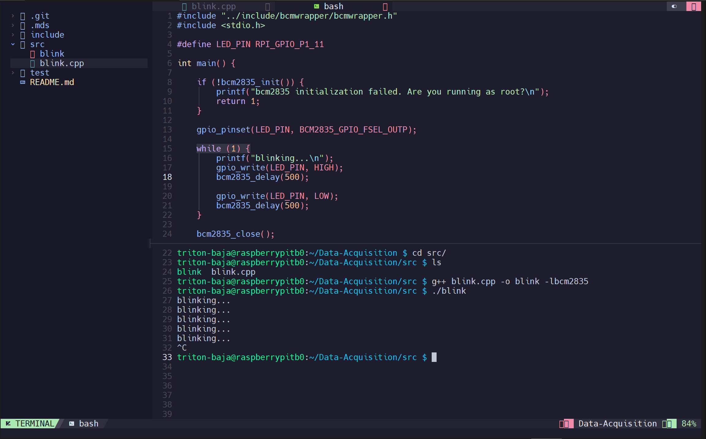

# Neovim
As you can tell by now, `nano` isn't the most helpful editor. It doesn't come with C/C++ support, barely any code highlighting, no auto completions, and no linting. Let's fix that by switching to neovim. 
Since we are using a Pi, which is ARM architecture we'll have to build it from source to get the most updated version. 

## Installing Neovim
First let's install the dependencies
```
sudo apt update
sudo apt install -y ninja-build gettext libtool libtool-bin autoconf automake cmake g++ pkg-config unzip curl doxygen clangd
```

Then let's increase git's buffer size
```
git config --global http.postBuffer 524288000
```

Clone the repo
```
git clone https://github.com/neovim/neovim
cd neovim
```

Get into the stable version
```
git checkout stable
```

Build and install
```
make CMAKE_BUILD_TYPE=Release
sudo make install
```

Verify installation
```
nvim --version
```

Delete all the downloaded files and anything that was created as a result of extracting

## Installing a nerd font
This will help us see icons as characters. First let's install `Fontconfig`, which manages fonts on Linux
```
sudo apt update
sudo apt install fontconfig
```

We'll use the JetBrains Mono Nerd
```
wget https://download.jetbrains.com/fonts/JetBrainsMono-2.304.zip
unzip JetBrainsMono-2.304.zip
```

Now let's install it for single user
```
mkdir -p ~/.local/share/fonts
mv fonts/ttf/*.ttf ~/.local/share/fonts/
mv fonts/variable/*.ttf ~/.local/share/fonts/
mv fonts/webfonts/*.woff2 ~/.local/share/fonts/
```

Refresh ftonc cache
```
fc-cache -fv
```

Verify installation
```
fc-list | grep "JetBrains Mono"
```

Delete all the downloaded files and anything that was created as a result of extracting

## Seting up NV Chad
This will be our base configuration for Neovim. First we'll remove the default neovim configuration
```
rm -rf ~/.local/share/nvim
```

Clone the NV CHad repo
```
git clone -b v2.0 https://github.com/NvChad/NvChad ~/.config/nvim --depth 1
```

## On Neovim's commands
Before we go any further, it is important that you familiarize yourself with some basic neovim commands. While we know neovim is way more powerful and customizable than nano, it is also a bit more complicated to use. Nothing impossible to learn either, it will just take some practice.

### Modes


Neovim has 7 BASIC modes, which dictate how neovim behaves. I'll go over 4 modes we'll be using. You can tell what mode you are in if you look at the bottom left corner, it should be highlighted in color.<br>

`NORMAL`: This is the default mode when neovim opens. In this mode you can run all the commands and enter all the other modes. You can always go back to `NORMAL` mode by pressing `Esc` or `Ctrl + C`. Here are a few things you can do in this mode:


- `Ctrl + N` to open/close the tree (file explorer)
- `Ctrl + H` to go from a file back to the tree
- `I` to enter `INSERT` mode
- `V` to enter `VISUAL` mode
- `:term` to enter `TERMINAL` mode
- `:sp` to split screen horizontally
- `:spv` to split screen vertically
- `:w` to save a file
- `:q` to close a file
- `:wq` to save and close a file
- `:qa` to exit neovim
- `:qa!` to force exit neovim (without saving)

`INSERT`: This is the mode in which you can modify the files, think of it as the default mode for any other editor, including `nano`, where you can just start typing in the file

`VISUAL`: This mode lets you copy blocks of code (and other things). To copy/paste:
- Move your cursor to the start of the block you want to copy
- Enter `VISUAL` mode
- Move your cursor to highlight the block of code you want to copy
- Press `y` to "yank" the block
- Go back to `NORMAL` mode
- Press `P` to paste.

`TERM`: This mode will open a terminal, which is useful to compile and run code without having to close and re open neovim when we want to go back to ther terminal.

For instance, this is how the setup could look like such that we have access to the tree, a file we are working on, and the terminal to compile/run it.<br>

<div align="center">

</div>


## Configure Neovim
Now follow [this video](https://www.youtube.com/watch?v=lsFoZIg-oDs), which will show you how to finish setting up neovim. Start at 1:15 and follow at least until 7:05.<br>

Then we'll set up indentation. Inside the configuration directory, `~/.config`, modify `nvim/lua/core/init.lua` such that under `-- Indenting` you see
```lua
-- Indenting
opt.tabstop = 4
opt.shiftwidth = 4
opt.softtabstop = 4
opt.expandtab = false
opt.smartindent = true
```
Finally, we want the terminal to always be in insert mode, `TERMINAL`. We'll modify `nvim/init.lua` to achieve this. At the end of the file add
```
-- Custom

vim.api.nvim_create_autocmd("TermOpen", {
  pattern = "*",
  command = "startinsert",
})

vim.api.nvim_create_autocmd({"BufEnter", "WinEnter"}, {
  pattern = "*",
  callback = function()
    if vim.bo.buftype == 'terminal' then
      vim.cmd("startinsert")
    end
  end,
})

```
