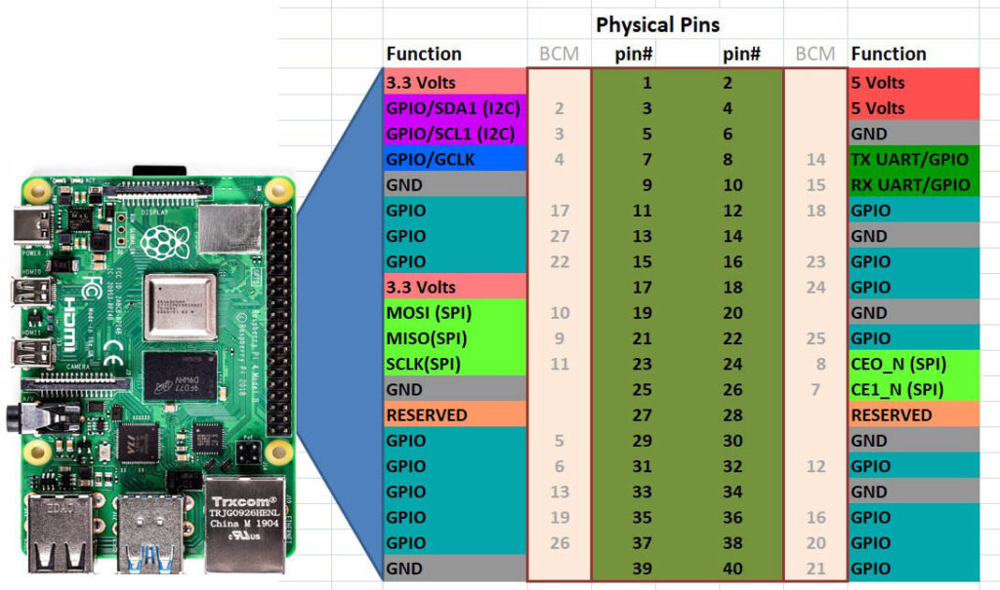

# BCM2835 Library
Every Raspberry Pi model has a diffferent version of the [Broadcom chip](https://www.raspberrypi.com/documentation/computers/processors.html), 
BCM2XXX. The Raspberry Pi 4B specifically has the BCM2711 chip. However, the [BCM2835 library](https://www.airspayce.com/mikem/bcm2835/) 
is compatible with all of the different Broadcom chip versions.

## Pinout

As you can see, the Raspberry Pi 4 has 40 pins, which have two different ways for being numbered, the physical pin number, and the bcm number. The bcm2835 library uses the latter when refering to `pin` in their functions.

## Basic bcm2835 functions
Note that we'll be showing you the [function prototypes](https://cplusplus.com/articles/yAqpX9L8/).<br><br>

```C++
void bcm2835_gpio_fsel(uint8_t pin, uint8_t mode);
```
This function is used to set a `pin` to an `BCM2835_GPIO_FSEL_OUTP` (output) or `BCM2835_GPIO_FSEL_INPT` (input). In other words, we need to tell the Pi if this pin will be "reading" or "writing", which it needs to know before we can use the pins.

```C++
void bcm2835_gpio_write(uint8_t pin, uint8_t on);
```
This function is used to write a `HIGH` or `LOW` value to a `pin`
