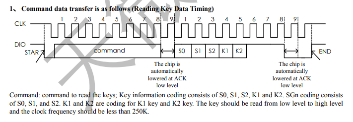

# TM1637


The tm1637 is a 4-digit, [7-segment](https://en.wikipedia.org/wiki/Seven-segment_display) display. What is particularly special about this module is that it isn't just the barebone display. It has an integrated microncontroller on board, which we can communicate with using [I²C](https://en.wikipedia.org/wiki/I²C). This way, instead of having to use 4 * 7 = 28 pins to set every individual segment to on or off, we just have to send commands to the microcontroller and it will take care of the rest for us. Unfortunately there are no widely used libraries for the tm1637 to interact with the Pi, so we'll make our very own.<br><br>

## Datasheet
We can look at the [datasheet](https://m5stack.oss-cn-shenzhen.aliyuncs.com/resource/docs/datasheet/unit/digi_clock/TM1637.pdf), which pretty much explains how the module works, how we are expected to communicate with the microcontroller, and the commands that we can use. It is pretty much everything we need to start [reverse engineering](https://en.wikipedia.org/wiki/Reverse_engineering) it and write a library for it. However, we might not even need to go that deep if we are smart about it.

<div align="center">
  
</div>

## Arduino Library
Thankfully there is already an [Arduino library](https://docs.arduino.cc/libraries/tm1637/) by Avishay Orpaz for this module. Unfortunately we are working with a Pi, not an Arduino. However, we can analyze some example code of how they control the tm1637, then go into the library, track those functions, see how they work, and write an equivalent library for the Pi. 

```C++
#include <Arduino.h>
#include <TM1637Display.h>

#define CLK 2
#define DIO 3

TM1637Display display(CLK, DIO);

void setup(){}

void loop(){

  uint8_t data[4];
  display.setBrightness(0x0f);

  data[0] = display.encodeDigit(0);
  data[1] = display.encodeDigit(1);
  data[2] = display.encodeDigit(2);
  data[3] = display.encodeDigit(3);
  display.setSegments(data);

  delay(3000);

  data[0] = display.encodeDigit(4);
  data[1] = display.encodeDigit(5);
  data[2] = display.encodeDigit(6);
  data[3] = display.encodeDigit(7);
  display.setSegments(data);

  delay(3000);
 
}
```

This code is pretty simple. As we can see we start by defining the pins we'll use for CLK, and DIO, then we create an array `data` of `uint8_t`, which we can see we use to store the individual numbers for the 4 displays we have. Then we tell the display to actually show this using the `setSegments(data)` function. So this code would tell the display to show `0123` for 3 seconds, then show `4567` for 3 seconds, then repeat. 

Now we can look into the library, which I have included in the [include/Arduino_TM1637](https://github.com/Triton-Baja/Data-Acquisition/tree/main/include/Arduino_TM1637) directory for your convenience. If we track the functions used here, you'll quickly realize the library is just a bunch of `gpio_pinmode`s, `gpio_write`s, `gpio_read`s, `delay`s, and binary operations. All of which we know how to do for the Pi.

Your task will be to implement not a library (since that would be a bit more complicated), but rather a `tm1637_example.cpp` that will mimic the code we just showed you as an example.
