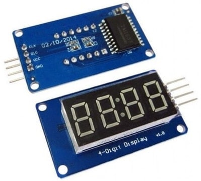

# TM1637

The tm1637 is a 4-digit, [7-segment](https://en.wikipedia.org/wiki/Seven-segment_display) display. What is particularly special about this module is that it isn't just the barebone display. It has an integrated microncontroller on board, which we can communicate with using [I²C](https://en.wikipedia.org/wiki/I²C). This way, instead of having to use 4 * 7 = 28 pins to set every individual segment to on or off, we just have to send commands to the microcontroller and it will take care of the rest for us. Unfortunately there are no widely used libraries for the tm1637 to interact with the Pi, so we'll make our very own.  

We can look at the [datasheet](https://m5stack.oss-cn-shenzhen.aliyuncs.com/resource/docs/datasheet/unit/digi_clock/TM1637.pdf), which pretty much explains how the module works, how we are expected to communicate with the microcontroller, and the commands that we can use. It is pretty much everything we need to start [reverse engineering](https://en.wikipedia.org/wiki/Reverse_engineering) it and write a library for it. However, we might not even need to go that deep if we are smart about it.

  

